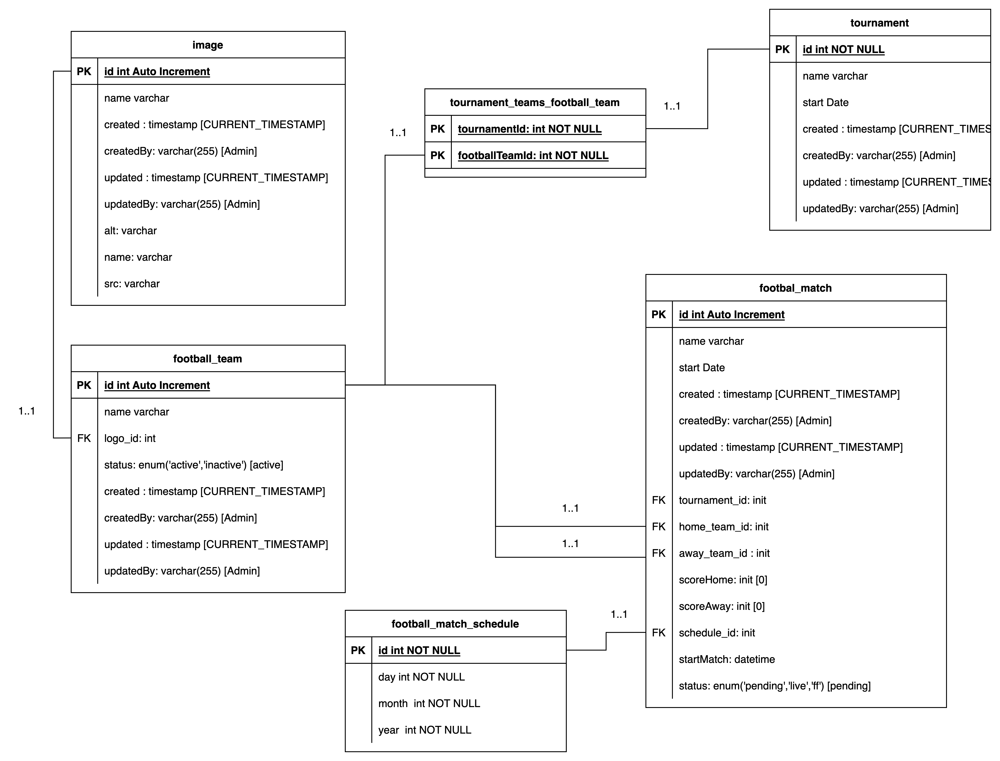

# Jack Tran : ZUJ LAB Backend API end design database

Created by Jack Tran on Mar 17, 2023

> Provider API support our frontend (web and mobile) teams. Get List Calendar and Get FootBall Match with calendar

Product Name: ZUJ-Backend Coding Assignment-041022-014330-1

Product Version: v0.0.1

---

### ZUJ Lab Backend's requirements
<br />
You have been tasked to build APIs to support our frontend (web & mobile) teams for the sections circled (in red) in the image above. These sections are known as the Fixtures module, and we will need APIs to support Fixtures Listing and Fixtures Calendar to display only dates with matches.

<!-- ZUJ Lab Backend Objectives -->

---

### For Docker debugging

<br />

- To start the application and all the needed services


```
docker compose up -d  # or yarn start:docker
```

Then browser http://localhost:3000/docs to view APIs Document

<br />

- To seeding datas

```
docker compose -f docker-compose.seed.yml up -d # or yarn seed:docker
```

<br />

---

## Database Design

<br />



---

## API End Point

Server: [http://127.0.0.1](http://127.0.0.1):3000

Swagger: [http://127.0.0.1](http://127.0.0.1):3000/docs

### Routes:

#### Tournament:

1.  Create tournament (End Point: “tournament/create“, Methods: POST)
2.  Get a list of tournament (End Point: “tournament“, Methods: GET)
3.  Match Arrangement (End Point: “tournament/match-arrangement“, Methods: POST)
4.  Team Participating in the Tournament (End Point: “tournament/id/:id“, Methods: PUT)
5.  **Get The List of Fixtures available (End Point: ”**tournament/calendar**”, Methods: GET)**
6.  **Get a list of matches (End Point: “**tournament/match**“, Methods: GET)**

#### FootballTeam:

1.  Get a list of football teams (End Point: “football-team“, Methods: GET)
2.  Create new football teams (End Point: “football-team/create“, Methods: POST)

---

## TECH

- NestJS base Project
- Project use database MySQL
- Lib: ClassValidator, ClassTransformer, TypeORM, dayjs

---

## SET UP PROJECT

### With Docker

Run file docker compose (Install MSQL and Start Application)

docker-compose up -d

Server: [http://127.0.0.1](http://127.0.0.1):3000

Swagger: [http://127.0.0.1](http://127.0.0.1):3000/docs

### With Local

> Required Computer installed

1.  MySQL (v8.0.32)
2.  NodeJS (v18.14.0)
3.  Yarn (v1.22.19)

Update file .env with format example

```
MYSQL_HOST=127.0.0.1
MYSQL_PORT=3306
MYSQL_USER=master_user
MYSQL_PASSWORD=password
MYSQL_DB=lab
```

Install Lib :

```
yarn
```

Migrations

- gernerate migration files to ./migrations directory 
```
yarn migration:generate --name=<meaningful_name>
```

- apply exists ./migrations files: 
```
yarn migration:run
```

- <i>(Optional)</i> seeding datas: 
```
yarn seed
```

Run dev :

```
yarn start:dev
```

Or Run Production with build Nestjs

```
yarn build
yarn start
```

---
